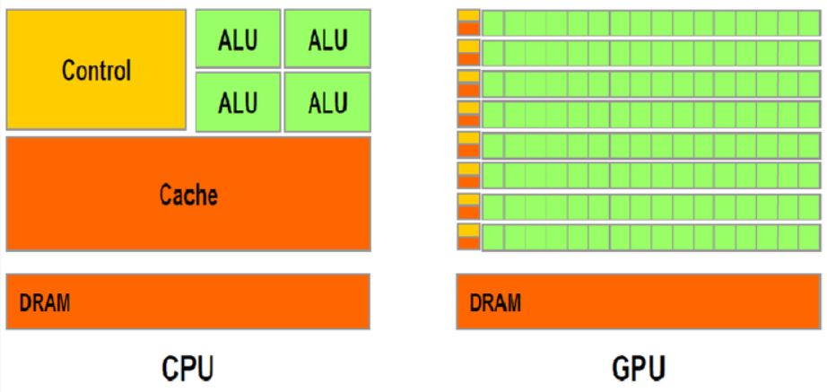

# Medical_Deeplearning

이 소스코드는 의료영상처리 딥러닝을 위한 소스코드입니다.

Gihub 란?
* 프로그램 등의 소스 코드 관리를 위한 분산 버전 관리 시스템이다.

Google Colab 이란?

[Tutorial 실습 링크](https://colab.research.google.com/github/Yonsei-MILab/Medical_Deeplearning/blob/master/CNN_VGG(Cifar10).ipynb)

CPU/GPU

{:height="50%" width="50%"}

* CPU : 내부 면적의 절반 이상은 캐시 메모리로 채워져 있다. 캐시 메모리는 CPU와 램(RAM)과의 속도차이로 발행하는 병목현상을 막기 위한 장치다. CPU가 처리할 데이터를 미리 RAM에서 불러와 CPU 내부 캐시 메모리에 임시로 저장해 처리 속도를 높일 수 있다.

* GPU :  여러 명령어를 동시에 처리하는 병렬 처리 방식을 가지고 있다. 캐시 메모리 비중이 크지 않고 연산을 할 수 있는 ALU 개수가 많다.
